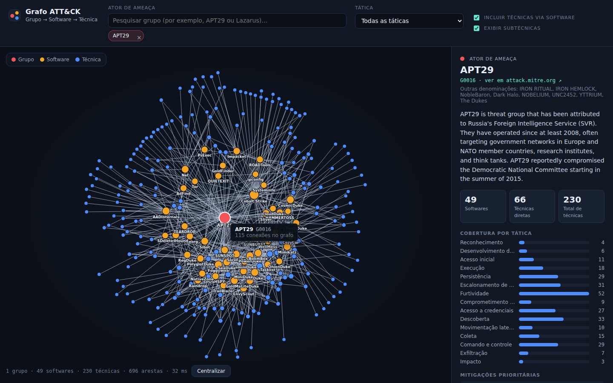

# Grafo ATT&CK: painel executivo de inteligência de ameaças cibernéticas em D3.js

Visualização interativa, em **grafo com disposição por simulação de forças**, dos dados STIX do **MITRE ATT&CK Enterprise**, com foco no encadeamento:

**Ator de Ameaça (Grupo) → Software (Malware/Ferramenta) → Técnica (Attack Pattern)**

Em vez da matriz tradicional de táticas × técnicas, a interface apresenta *quem* ataca, *com quais recursos* e *de que forma*, partindo de um único grupo para não sobrecarregar a leitura.



## Funcionalidades

- Nós coloridos por tipo: **Grupo = vermelho**, **Software = laranja**, **Técnica = azul**.
- Abertura filtrada no grupo **APT29**; pesquisa de atores por nome, identificador (`G0016`) ou denominação alternativa, com até cinco grupos simultâneos.
- Ao clicar em um nó, as respectivas conexões são destacadas (os demais elementos ficam esmaecidos) e o **painel lateral** exibe descrição, identificador do MITRE, cobertura por tática, mitigações prioritárias e softwares e grupos relacionados.
- Filtros por **tática**, **técnicas via software** e **subtécnicas** (quando desativado, as subtécnicas são agrupadas na técnica principal).
- Deslocamento, ampliação e arraste de nós; os rótulos das técnicas aparecem ao ampliar a visualização.
- Tema escuro com arestas de opacidade adaptativa.
- Interface em português; nomes e identificadores oficiais do MITRE (grupos, softwares e técnicas) são mantidos no original, e as táticas são exibidas traduzidas, com o nome oficial em inglês disponível no seletor.

## Como executar

```bash
npm install
npm run dev        # http://localhost:5173
```

O repositório já inclui o conjunto de dados pré-processado em `public/data/attack-graph.json` (cerca de 1,5 MB); portanto, a aplicação funciona sem downloads adicionais.

## Atualizar os dados do MITRE

O arquivo oficial `enterprise-attack.json` tem cerca de 54 MB e **não é versionado** (permanece em `data/`, diretório ignorado pelo Git). Para obter a versão mais recente e gerar novamente o JSON reduzido:

```bash
npm run data       # = npm run fetch-data && npm run etl
```

Ou, manualmente:

```bash
curl -L -o data/enterprise-attack.json \
  https://raw.githubusercontent.com/mitre-attack/attack-stix-data/master/enterprise-attack/enterprise-attack.json
node scripts/etl.mjs data/enterprise-attack.json public/data/attack-graph.json
```

O processo de ETL mantém apenas os objetos `intrusion-set`, `malware`, `tool` e `attack-pattern` e os relacionamentos `uses`, descarta objetos revogados ou descontinuados e associa mitigações e táticas a cada técnica. A aplicação **não** consulta o servidor TAXII em tempo real: todos os dados são carregados de um arquivo JSON estático.

## Deploy no Vercel

O `vercel.json` já está configurado: o build baixa o STIX oficial, roda o ETL e publica `dist/`. Basta importar o repositório em [vercel.com/new](https://vercel.com/new) e confirmar.

## Validação

```bash
npm run dev &
npm run validate   # Chromium sem interface: verifica <circle>, <line>, <text>, erros no console e interações
```

Defina `CHROMIUM_PATH=/caminho/do/chrome` caso o Chromium esteja instalado em outro local.

## Estrutura

```
scripts/fetch-data.mjs   download do arquivo STIX oficial
scripts/etl.mjs          STIX -> { nodes, links } reduzido
scripts/validate.mjs     teste automatizado no navegador
src/data.js              índices e montagem do subgrafo
src/i18n.js              tradução das táticas e formatação em português
src/graph.js             motor D3 (forças, zoom, destaque)
src/sidebar.js           painel lateral executivo
src/main.js              filtros, pesquisa e orquestração
STATUS_GRAFO_MITRE.md    situação do desenvolvimento
```

## Fonte dos dados

[MITRE ATT&CK®](https://attack.mitre.org/) — © The MITRE Corporation. Dados utilizados conforme os [termos de uso do ATT&CK](https://attack.mitre.org/resources/legal-and-branding/terms-of-use/).
